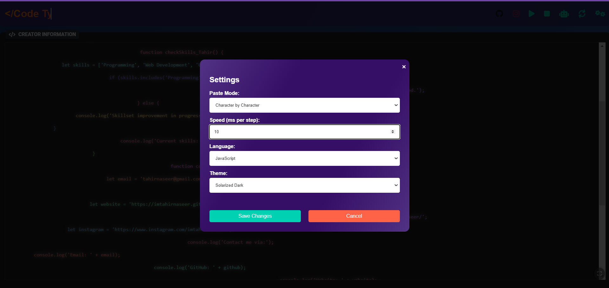

# Code-Type-Writer# Code Type-Writer

A powerful and interactive typing simulator for code, designed to mimic the experience of typing out code in a typewriter style. It supports various programming languages, customizable paste modes, and themes to enhance the user experience.


## **Why Code Type-Writer is Perfect for YouTubers?** 🎥  

### **1. Boost Your Video Engagement**  
- Create visually appealing code demonstrations that capture your audience's attention.  
- Add dynamic, real-time code typing effects to make your tutorials stand out.

### **2. Complete Control Over Typing Modes**  
- Switch between **Character-by-Character**, **Word-by-Word**, or **Line-by-Line** typing styles.  
- Customize the typing speed to match your teaching pace.

### **3. Personalize Your Code Presentation**  
- Select from **50+ programming languages** and match your tutorial topic.  
- Change themes to fit your video aesthetic and make syntax stand out.

### **4. Effortless Setup for Content Creation**  
- Just **paste your code** into the editor, and the tool handles the rest.  
- Save time and focus on delivering high-quality tutorials.

## **How This Tool Can Help You?**  

Imagine you're teaching a JavaScript function on YouTube. Instead of directly pasting the code, you can use **Code Type-Writer** to type the code dynamically, step by step. This keeps your viewers engaged, making the learning process interactive and fun.

### **Example:**  
- Use **dark mode themes** for coding at night.  
- Use **character-by-character mode** to explain each line of code slowly.  
- Highlight HTML, CSS, or Python in vibrant colors to make your tutorials attractive.

---

## Features

- **Customizable Typing Modes:** Choose between character-by-character, word-by-word, or line-by-line typing modes.
- **Adjustable Speed:** Control how fast the code appears on the screen, from slow to fast (in milliseconds).
- **Language Support:** Supports multiple programming languages like HTML, CSS, JavaScript, Python, and more.
- **Theme Customization:** Pick from a wide range of themes to match your video’s visual style.
- **Interactive UI:** Easy-to-use interface with real-time updates.

---
## Demo

You can see a live demo of the Code Type-Writer [Live Demo](hhtps://imtahirnaseer.github.io/Code-Type-Writer/). Below is a screenshot of the project in action.



## Installation

1. Clone this repository:
   ```bash
   git clone https://github.com/imtahirnaseer/Code-Type-Writer.git
